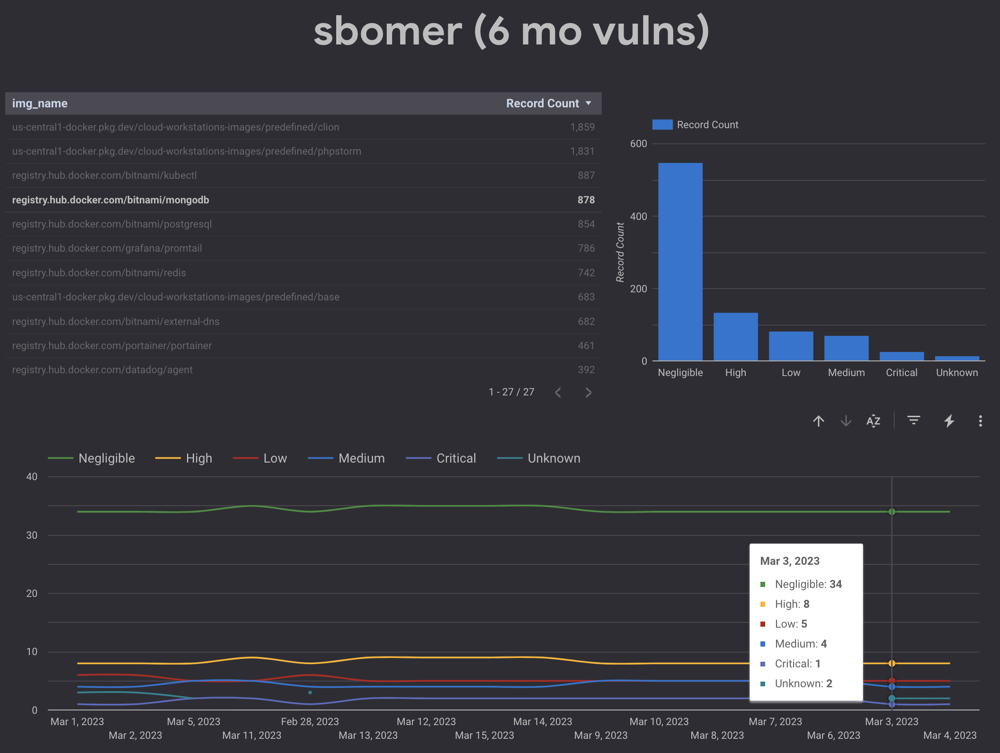

# sbomer 

Generates daily SBOM (using [syft](https://github.com/anchore/syft)) and vulnerability reports (using [grype](https://github.com/anchore/grype)) for local list of images ([images](./images)) and N number of [most popular community images](https://hub.docker.com/api/content/v1/products/search?page=1&page_size=20&q=%2B&source=community&type=image%2Cbundle) on [Docker Hub](https://hub.docker.com/). The resulting files are saved to GCS bucket, and data is imported into BigQuery tables. GCP authentication implemented using [OIDC](https://cloud.google.com/identity-platform/docs/web/oidc). 



## setup 

To setup your own instance of `sbomer` first, fork this repo and clone it locally. Next, deploy the service account, GCS bucket, and OIDC provider to your GCP project: 


```shell
make setup
```

When prompted, provide the two required parameters: 

* `project_id` - the ID of your GCP project (e.g. `your-project-id`)
* `git_repo` - the name of your forked github repo (e.g. `your-github-username/your-repo-name`)

> The defaults for optional parameters are defined in [setup/variables.tf](setup/variables.tf).

The output will include the parameters you will need to update in [.github/workflows/process.yaml](.github/workflows/process.yaml). Find the `auth_provider`, `auth_account`, and `target_bucket` environment variables and update them with the `PROVIDER`, `ACCOUNT`, and `BUCKET` using values provided from the setup respectively:

```yaml
env:
  auth_provider: "<PROVIDER>"
  auth_account: "<ACCOUNT>"
  target_bucket: "<BUCKET>"
```

The workflow is currently set to execute multiple times a day. If you want change that, alter the schedule at the top of [.github/workflows/list.yaml](.github/workflows/list.yaml). 

```yaml
on:
  schedule:
    - cron: '0 */5 * * *'
```

To test, simply commit your changes and push upstream. In addition to the above described schedule, the workflow will also execute on each main branch push or PR. 

## on-demand process

You can also execute the `process` workflow manually for any publicly accessible container image using either GitHub CLI (`gh`) or `curl`. For example, to generate SBOM and vulnerability report for the `redis` image using either of these options:

### gh

> Instructions on how to install GitHub CLI are located [here](https://cli.github.com/manual/installation).

```shell
gh workflow run .github/workflows/process.yaml -f image="redis"
```

### curl 

```shell
curl \
  -X POST \
  -H "Accept: application/vnd.github.v3+json" \
  -H "Authorization: token $GITHUB_ACCESS_TOKEN" \
  https://api.github.com/repos/$ORG/$REPO/actions/workflows/process.yaml/dispatches \
  -d '{"ref":"main", "inputs": { "image":"redis" }}'
```

## data

The data from SBOM and vulnerability report for each image is saved into two tables in BigQuery:

### pkg 

The [setup/schema/pkg.json](setup/schema/pkg.json) file containers complete schema used to create `pkg` table.

| field | type  | required |
| ----- | ----- | ------- |
| src_img	| STRING | Y |
| pkg_id	| STRING |	Y |			
| gen_day	| STRING |	Y |			
| gen_time	| STRING |	Y |			
| gen_by	| STRING |	Y |			
| pkg_name	| STRING |	Y |			
| pkg_version	| STRING |	Y |			
| pkg_license	| STRING |	Y |			
| ref_cat	| STRING |	Y |			
| ref_type	| STRING |	Y |			
| ref_locator	| STRING |	Y |

### vul 

The [setup/schema/vul.json](setup/schema/vul.json) file containers complete schema used to create `vul` table.

| field | type  | required |
| ----- | ----- | ------- |
| src_img	| STRING |	Y |			
| src_sha	| STRING |	Y |
| gen_day	| STRING |	Y |		
| vul_id	| STRING |	Y |		
| vul_src	| STRING |	Y |		
| vul_sev	| STRING |	Y |	
| vul_state	| STRING |	Y |		
| art_name	| STRING |	Y |		
| art_version	| STRING |	Y |		
| arg_lang	| STRING |	Y |		
| art_purl	| STRING |	Y |

## cleanup

To delete all the resources created by Terraform in your GCP project: 

```shell
make destroy
```

## disclaimer

This is my personal project and it does not represent my employer. While I do my best to ensure that everything works, I take no responsibility for issues caused by this code.
